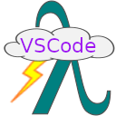
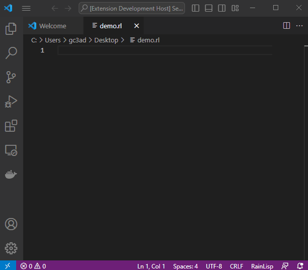

# RainLisp VSCode

[](LICENSE.txt)



VSCode extension for [RainLisp](https://github.com/chr1st0scli/RainLisp) support.

## Features

This extension offers syntax highlighting, code completion with snippets and integration with RainLisp's interpreter.



In order to get started with RainLisp, you can visit its [repository](https://github.com/chr1st0scli/RainLisp),
where you can find a [tutorial](https://github.com/chr1st0scli/RainLisp/blob/master/RainLisp/Docs/quick-start.md) and other material.

## Requirements

If you want to run RainLisp code and not just write it, you need to download the interpreter, [RainLisp Console](https://github.com/chr1st0scli/RainLispConsole).

You need to have .NET 6 or later installed.

In order to download RainLispConsole from NuGet and install it as a global tool, run the following command in a command line shell.

```
dotnet tool install -g RainLispConsole --version "*-alpha*"
```

If you already have it installed and you want to update it, run the following command.

```
dotnet tool update -g RainLispConsole --version "*-alpha*"
```

Once installed, you can hit Ctrl + F5, or cmd+9 for MacOS, while working with a RainLisp (*.rl) file, to run the code.

## Release Notes

### 0.0.1

Initial release.

**Enjoy!**
